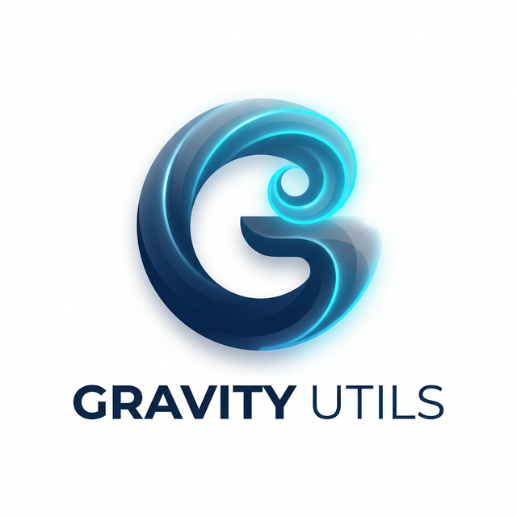

<div align="center">
  
  <h1>🚀 Gravity Utils (Bozdemir Engine)</h1>
  <p>
    <strong>Gelişmiş, Yüksek Performanslı, Platformlar Arası Araç Seti</strong>
  </p>
  
  []()
  []()
  []()
  []()
</div>

---

**Gravity Utils**, ofis formatı dönüşümleri, şablon yönetimi, medya analizi, yazılımcı araçları ve daha birçok donanımsal aracı tek bir çatı altında birleştiren yeni nesil bir masaüstü ve web uygulamasıdır. 

**Bozdemir Core Engine** altyapısıyla çalışır: Yerel dosya sistemini zorlamadan yüksek hızlı işlemler, akıllı içerik analizleri ve kusursuz mimari sunar.

## ✨ Özellikler

*   📝 **Word Şablon Merkezi (Mail Merge)**
    *   Sürükle bırak blok mimarisiyle gelişmiş Word (`.docx`) şablonları oluşturun.
    *   Excel, CSV veya JSON üzerinden binlerce veriyi saniyeler içinde şablonlara basın (Bulk Export).
*   🔄 **Akıllı Ofis Dönüştürücüler (Smart Adapters)**
    *   PDF'ten Word'e (Tablo, Başlık ve Liste Algılama altyapısıyla)
    *   Word'den PDF'e (Yüksek kaliteli HTML2Canvas & PDF-lib Mimarisi)
    *   Excel'den PDF/Word'e, PDF'ten Resme ve Resimden PDF'e
*   🛠️ **DevTools & Geliştirici Araçları**
    *   JSON Formatlayıcı ve Validatör, Base64 Kodlayıcı, Hash Oluşturucu vb.
*   🎥 **Medya ve PDF Yöneticisi**
    *   Sistem bazlı çalışan performanslı işlem araçları
*   ⚡ **Çift Platform Ortamı (Web + Masaüstü)**
    *   Aynı ortak paket (`packages/shared`) üzerinden hem Web (Next.js) hem de Native Masaüstü (Electron) deneyimi.

---

## 🏗️ Mimari Yapı (Monorepo)

Proje, `pnpm` workspace kullanılarak modern bir monorepo formatında kurgulanmıştır:

```text
gravity-utils/
├── apps/
│   ├── web/          # Next.js Tabanlı Web Uygulaması
│   └── desktop/      # Electron (Native) Masaüstü Uygulaması + Vite arayüzü
├── packages/
│   └── shared/       # Her iki platformun da paylaştığı Core Context, Bileşenler ve Araçlar
```

---

## 🚀 Başlangıç & Kurulum

Öncelikle sisteminizde **Node.js (v18+)** ve **pnpm** kurulu olduğuna emin olun.

1. Bağımlılıkları yükleyin:
   ```bash
   pnpm install
   ```

2. Geliştirme ortamını başlatın:
   * **Web:**
     ```bash
     pnpm web:dev
     ```
   * **Masaüstü (Electron):**
     ```bash
     pnpm desktop:dev
     ```
   * **İkisini Birlikte Başlatmak:**
     ```bash
     pnpm dev:all
     ```

---

## 📦 Masaüstü Uygulamasını Derleme (Build)

Uygulamayı bir Windows Setup `.exe` dosyası haline getirmek için özel derleme altyapısı mevcuttur.

1. **Build komutunu çalıştırın:**
   ```bash
   pnpm desktop:build
   ```

2. **Çıktı:**
   İşlem tamamlandığında derlenmiş Setup dosyası `apps/desktop/dist/` klasöründe oluşacaktır. 
   *(Örnek Çıktı: `Gravity Utils Setup 1.0.0.exe`)*

### Özel Derleme Senaryoları / Temizlik Komutları

* `pnpm clean:all` : Tüm ortamı kökten temizler (Tüm `.next`, `dist`, `out`, ve `node_modules` klasörlerini uçurur). Yeni bir temiz başlangıç için birebirdir.
* `pnpm desktop:clean` : Sadece desktop build klasörlerini siler.
* `pnpm desktop:sync` : Web tarafı klasörünü derleyip direkt Desktop'a eşler (nadiren manuel senaryolarda gerekir).

---

## 🧩 Modüler Genişletilebilirlik (Shared Package)

Yeni bir araç veya sayfa yapacağınızda doğrudan `apps/web` veya `apps/desktop` içine kod yazılmaz. Ana prensibimiz şudur:
Mümkün olan tüm Modüller, Utility fonksiyonları ve React View`ları  **`packages/shared`** içerisine konumlandırılır.
Masaüstü ve Web bu kütüphaneden bileşeni alır ve sarmallar. Bu sayede **Arayüz Tutarlılığı** ve minimum kod tekrarı sağlanır.

### IPC Native Pipeline (Electron Özellikleri)
Masaüstü uygulamasında Browser'ın memory limitlerini aşan büyük dosyalar yazılırken `window.electron.saveFileFromBuffer` ve Custom Protocol mekanizmaları (`app://`) kullanılır.

---

## 👨‍💻 Yazar & Lisans

Büyük bir tutkuyla mimari edilmiştir. 🖤

**(c) 2026 Ilyas Bozdemir - Gravity Utils**